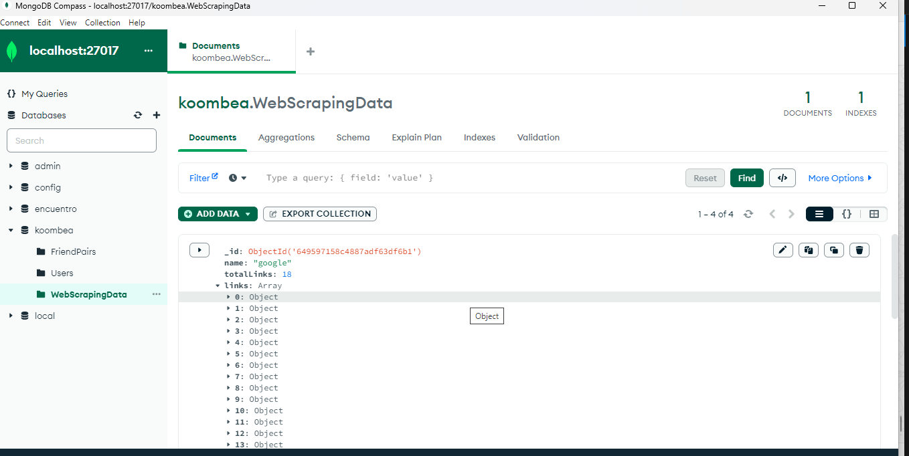
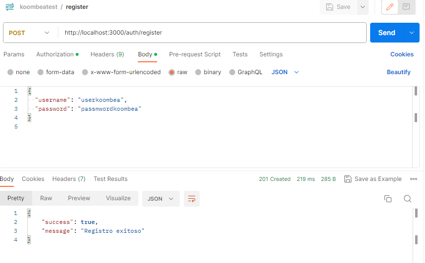
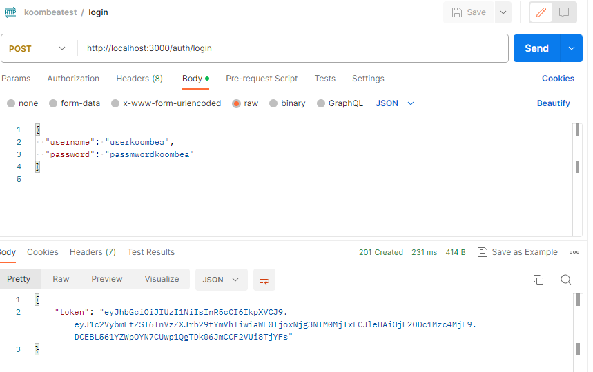
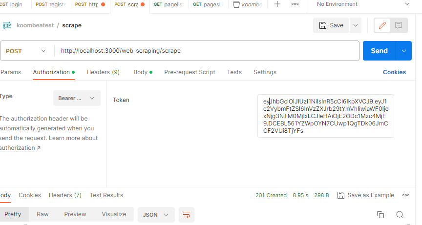
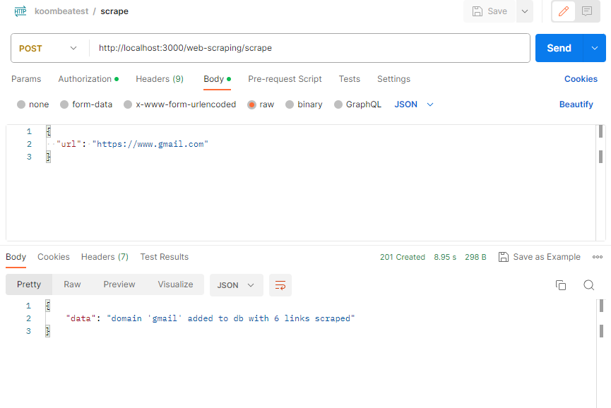
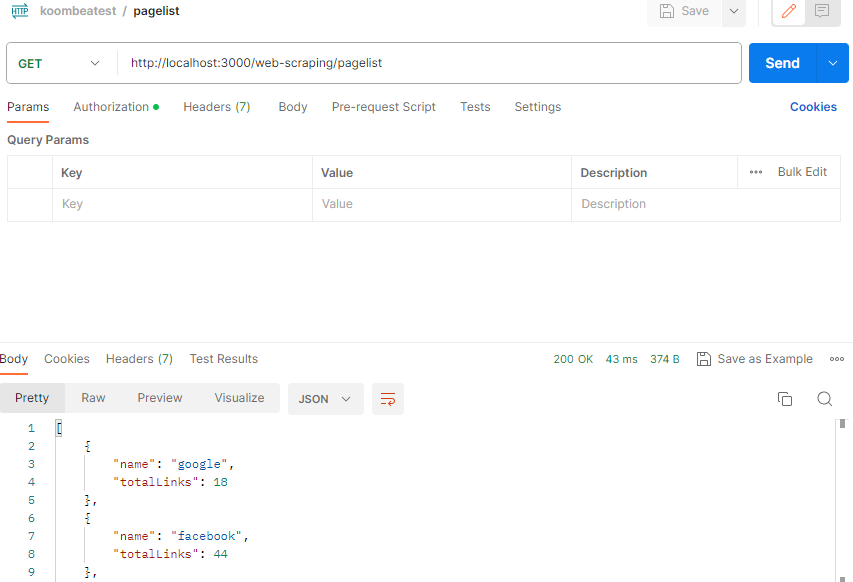
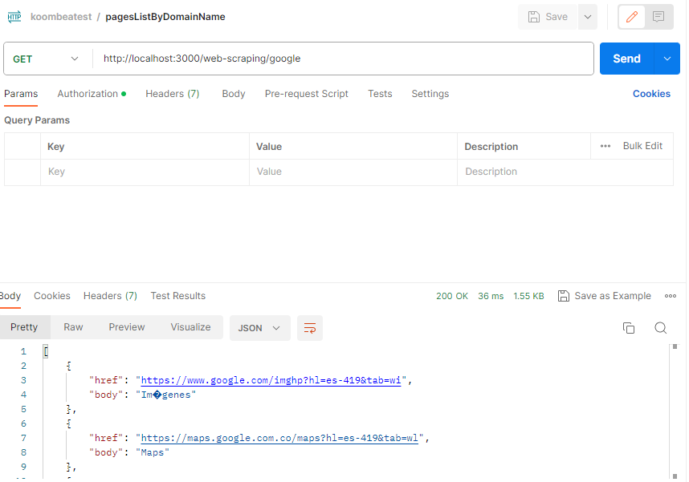

## Description para prueba Koombea
 - el repositorio es https://github.com/miguelposada/pruebaKoombea.git la rama es development
 - se hizo uso del framework NestJS, base de datos MongoDB y el ORM Mongoose.
 - se implemento un Middleware que da proteccion a las rutas.
 - se definio una coleccion en mongoDB llamada WebScrapingData para almacenar la informacion asi:
   
 - el servicio de registro se hizo mediante username y password en el cuerpo de la peticion(valida usuarios existentes)
   
 - el servicio de logueo se implemento recibiendo un JWT y username y password en el cuerpo
   

  ## se definieron tres servicios para dar cumplimiento a los requerimientos de Scrape
 - para usar el servicio de scrape y los demas servicio es necesario usar autenticacion Bearer token en postman  
   
 - este es el resultado despues de usarlo con el token
   
 - un servicio de Listar con cantidad total
   
 - un servicio de listar links por dominio
   

   ## Installation for Koombea test

```bash
$ npm install
```
## Nota: no olvidar tener instalado mongoDB y si se desea el MongoDB Compass
## en el repositorio se adjunta la coleccion de postman para pruebas 
`koombeatest.postman_collection`

## algunas pruebas unitarias aun no estan corriendo exitosamente debido a la falta de tiempo pero si estan muy avanzadas


<p align="center">
  <a href="http://nestjs.com/" target="blank"></a>
</p>

[circleci-image]: https://img.shields.io/circleci/build/github/nestjs/nest/master?token=abc123def456
[circleci-url]: https://circleci.com/gh/nestjs/nest

  <p align="center">A progressive <a href="http://nodejs.org" target="_blank">Node.js</a> framework for building efficient and scalable server-side applications.</p>
    <p align="center">
<a href="https://www.npmjs.com/~nestjscore" target="_blank"></a>
<a href="https://www.npmjs.com/~nestjscore" target="_blank"></a>
<a href="https://www.npmjs.com/~nestjscore" target="_blank"></a>
<a href="https://circleci.com/gh/nestjs/nest" target="_blank"></a>
<a href="https://coveralls.io/github/nestjs/nest?branch=master" target="_blank"></a>
<a href="https://discord.gg/G7Qnnhy" target="_blank"></a>
<a href="https://opencollective.com/nest#backer" target="_blank"></a>
<a href="https://opencollective.com/nest#sponsor" target="_blank"></a>
  <a href="https://paypal.me/kamilmysliwiec" target="_blank"></a>
    <a href="https://opencollective.com/nest#sponsor"  target="_blank"></a>
  <a href="https://twitter.com/nestframework" target="_blank"></a>
</p>
  <!--[](https://opencollective.com/nest#backer)
  [](https://opencollective.com/nest#sponsor)-->


[Nest](https://github.com/nestjs/nest) framework TypeScript starter repository.

## Installation

```bash
$ npm install
```

## Running the app

```bash
# development
$ npm run start

# watch mode
$ npm run start:dev

# production mode
$ npm run start:prod
```

## Test

```bash
# unit tests
$ npm run test

# e2e tests
$ npm run test:e2e

# test coverage
$ npm run test:cov
```

## Support

Nest is an MIT-licensed open source project. It can grow thanks to the sponsors and support by the amazing backers. If you'd like to join them, please [read more here](https://docs.nestjs.com/support).

## Stay in touch

- Author - [Kamil Myśliwiec](https://kamilmysliwiec.com)
- Website - [https://nestjs.com](https://nestjs.com/)
- Twitter - [@nestframework](https://twitter.com/nestframework)

## License

Nest is [MIT licensed](LICENSE).

# para probar desde postman se adjunta en el repositorio el archivo para importar en postman
$ npm run test:e2e